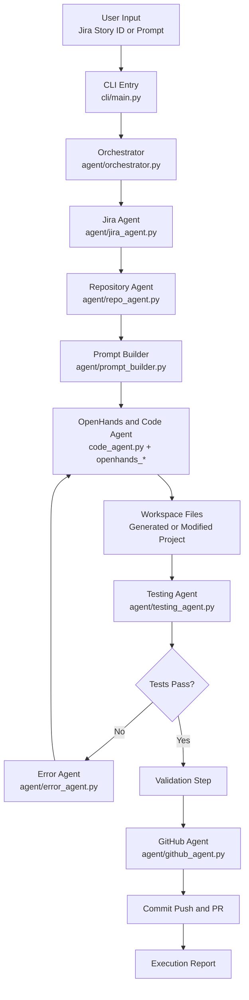

# Autonomous Dev Agent Report

## 1. Project Purpose

The Autonomous Dev Agent is a Python-based software engineering automation system that takes either a Jira story or a natural-language prompt and drives the full delivery loop: understand requirements, inspect the repository, generate code, run tests, fix failures, commit changes, and open a GitHub pull request.

This project exists to reduce the manual handoff between product requirements and engineering execution. Instead of using separate tools for requirement reading, repo analysis, code generation, testing, and GitHub operations, this repository combines them into one orchestrated workflow.

## 2. High-Level Architecture

The system is built around one central controller and several specialized agents:

- Orchestrator: controls the workflow from start to finish.
- Jira Agent: converts Jira or free-text prompts into structured requirements.
- Repo Agent: clones the repository and analyzes its conventions and structure.
- OpenHands / Code Agent: performs implementation inside a workspace.
- Testing Agent: runs project-appropriate tests and quality checks.
- Error Agent: classifies failures and prevents infinite healing loops.
- GitHub Agent: commits, pushes, and opens a pull request.
- Prompt Builder: turns requirements plus repo context into stronger prompts.
- MCP Server: exposes Jira and GitHub capabilities as tools.

This split is useful because each part has one clear responsibility. That makes the workflow easier to test, replace, and extend.

### Architecture Layers

- Input layer: the user starts the workflow through the CLI or Python module entry point.
- Control layer: the orchestrator manages state, sequencing, retries, and final reporting.
- Understanding layer: the Jira Agent and Repo Agent convert the problem and codebase into structured context.
- Planning layer: the Prompt Builder and solution-design step convert context into an implementation strategy.
- Execution layer: the OpenHands and Code Agent layer writes or modifies code inside the workspace.
- Validation layer: the Testing Agent and Error Agent verify quality, classify failures, and support healing.
- Delivery layer: the GitHub Agent commits the result, pushes the branch, and opens the pull request.

### Architecture Flow



#### Architecture Flow Without Mermaid

```text
User Input (Jira Story ID or Prompt)
   |
   v
CLI Entry (cli/main.py)
   |
   v
Orchestrator (agent/orchestrator.py)
   |
   +--> Jira Agent (agent/jira_agent.py)
   |
   +--> Repository Agent (agent/repo_agent.py)
   |
   +--> Prompt Builder (agent/prompt_builder.py)
   |
   v
OpenHands and Code Agent Layer
(code_agent.py + openhands_agent.py + openhands_runtime.py)
   |
   v
Workspace Files (generated or modified code)
   |
   v
Testing Agent (agent/testing_agent.py)
   |
   v
Are tests passing?
   | yes                          | no
   v                              v
Validation Step              Error Agent
   |                         (agent/error_agent.py)
   |                              |
   |                              v
   |----------------------> Back to code generation
   |
   v
GitHub Agent (agent/github_agent.py)
   |
   v
Commit, Push, Pull Request
   |
   v
Execution Report
```

The actual execution flow of the system is:

1. The user starts the agent through `agent run`, `python -m app`, or a prompt-based command.
2. `cli/main.py` loads configuration, validates credentials, and creates the orchestrator.
3. `agent/orchestrator.py` starts the workflow and initializes state tracking.
4. `agent/jira_agent.py` either fetches a Jira story or converts a natural-language prompt into structured requirements.
5. `agent/repo_agent.py` clones the repository, creates a working branch, and analyzes the project structure.
6. `agent/prompt_builder.py` helps generate a focused solution-design and implementation plan.
7. `agent/openhands_agent.py`, `agent/openhands_runtime.py`, and `agent/code_agent.py` execute implementation work in the workspace.
8. `agent/testing_agent.py` runs install, lint, build, and test commands depending on the detected project type.
9. If something fails, `agent/error_agent.py` classifies the failure and supports the self-healing loop.
10. After successful validation, `agent/github_agent.py` stages changes, commits, pushes, and creates a pull request.
11. The orchestrator returns a final execution report with status, changed files, test results, and PR details.

This flow is important because it shows that the project is not a single AI call. It is a controlled sequence of planning, execution, verification, and delivery.

### Architecture Explanation

- The CLI or module entry point receives the user's request.
- The orchestrator controls the full lifecycle and maintains workflow state.
- The Jira Agent turns input into structured requirements.
- The Repo Agent prepares the target repository and extracts coding context.
- The Prompt Builder improves the quality of the implementation and design prompts.
- The OpenHands and Code Agent layer performs actual coding work inside the workspace.
- The Testing Agent verifies the output against the target project's stack.
- The Error Agent supports retry and healing logic when tests fail.
- The GitHub Agent converts successful work into a commit, push, and PR.

This architecture is used because autonomous coding works best when planning, execution, validation, and delivery are separated but coordinated by one controller.

## 3. End-to-End Workflow

The implemented pipeline is:

1. Accept a Jira story ID or natural-language prompt.
2. Convert the request into structured requirements.
3. Clone the target repository and create a feature branch.
4. Analyze the codebase to detect language, framework, test setup, and likely edit points.
5. Produce a solution design plan.
6. Generate or modify code in the workspace through OpenHands.
7. Run tests and quality checks.
8. If tests fail, analyze the error and attempt targeted healing.
9. Validate the result against acceptance criteria.
10. Commit, push, and create a GitHub pull request.

This sequence is the main value of the project: it is not only a code generator, but a delivery pipeline controller.

### Workflow Of Autonomous Dev Agent

The complete working flow of the project is:

1. User gives input:
   A Jira story ID or a natural-language prompt is passed to the system through the CLI.
2. CLI starts execution:
   `cli/main.py` loads configuration, validates environment variables, and starts the orchestrator.
3. Orchestrator creates workflow state:
   `agent/orchestrator.py` tracks the current step, errors, generated files, test results, and PR output.
4. Requirements are prepared:
   `agent/jira_agent.py` fetches Jira issue details or converts the prompt into structured JSON requirements.
5. Repository is prepared:
   `agent/repo_agent.py` clones the target repository, creates a branch, and analyzes framework, language, and coding patterns.
6. Solution plan is generated:
   `agent/prompt_builder.py` and the design step create implementation guidance before code is written.
7. Code is generated:
   `agent/code_agent.py`, `agent/openhands_agent.py`, and `agent/openhands_runtime.py` generate or modify files in the workspace.
8. Tests are executed:
   `agent/testing_agent.py` runs the correct install, build, lint, and test commands for the detected stack.
9. Errors are analyzed:
   `agent/error_agent.py` identifies root-cause patterns and helps prevent repeated failed repair loops.
10. Validation is performed:
    The implementation is checked against the story acceptance criteria and test outcome.
11. GitHub delivery happens:
    `agent/github_agent.py` stages changes, commits them, pushes the branch, and creates a pull request.
12. Final output is produced:
    The orchestrator returns the workflow result including status, changed files, tests, and PR URL.

### Why This Workflow Is Important

- It converts raw requirements into structured engineering work.
- It ensures repository context is understood before code generation starts.
- It includes validation and repair, not just code writing.
- It connects implementation directly to Git and GitHub delivery.
- It makes the whole system suitable for autonomous development demonstrations.

### Project Structure

```text
ai-dev-agent/
├── agent/
│   ├── orchestrator.py     # Master workflow controller
│   ├── jira_agent.py       # Jira integration + requirement parsing
│   ├── repo_agent.py       # Repository cloning + analysis
│   ├── code_agent.py       # Code generation interface
│   ├── openhands_agent.py  # OpenHands workflow integration
│   ├── openhands_runtime.py # OpenHands runtime wrapper
│   ├── testing_agent.py    # Multi-language test runner
│   ├── github_agent.py     # Git operations + PR creation
│   ├── error_agent.py      # Error analysis and retry protection
│   ├── prompt_builder.py   # Prompt engineering for implementation
│   └── config.py           # Configuration management
├── app/
│   ├── __main__.py         # Supports python -m app
│   └── main.py             # App entry point
├── mcp/
│   └── server.py           # MCP server (Jira + GitHub tools)
├── cli/
│   ├── __init__.py         # CLI package export
│   └── main.py             # Rich CLI interface
├── sandbox/
│   ├── Dockerfile          # Multi-runtime container
│   └── docker-compose.yml  # Sandbox orchestration
├── tests/
│   └── test_agents.py      # Unit tests
├── workspace/
│   └── OpenHands/
│       ├── app.py          # Generated Flask app
│       ├── extensions.py   # Shared SQLAlchemy instance
│       ├── models.py       # Blog data models
│       ├── seed_data.py    # Demo seed data
│       ├── test_app.py     # Generated application tests
│       └── templates/      # Bootstrap UI templates
├── README.md               # Project documentation
├── pyproject.toml          # Package and tool config
├── agent.sh                # Runner shell script
├── .env.example            # Environment template
├── requirements.txt        # Python dependencies
└── AUTONOMOUS_DEV_AGENT_REPORT.md # Project report
```

### Repository Folder Structure With File Responsibilities

- `agent/orchestrator.py`: main controller for the complete autonomous workflow.
- `agent/jira_agent.py`: fetches Jira stories or converts prompts into structured requirements.
- `agent/repo_agent.py`: clones repositories, creates branches, and analyzes the target codebase.
- `agent/code_agent.py`: exposes the code-generation interface used by the orchestrator.
- `agent/openhands_agent.py`: integrates OpenHands into the agent workflow for coding and fixing.
- `agent/openhands_runtime.py`: manages runtime execution and workspace interaction for OpenHands tasks.
- `agent/testing_agent.py`: detects project type and runs lint, build, and test commands.
- `agent/github_agent.py`: handles git operations and pull request creation.
- `agent/error_agent.py`: analyzes failures and detects repeated-error loops.
- `agent/prompt_builder.py`: builds high-quality prompts for design and implementation.
- `agent/config.py`: defines structured configuration objects and validation logic.
- `app/main.py`: module-based startup entry point that forwards execution to the CLI.
- `app/__main__.py`: allows `python -m app` execution.
- `cli/main.py`: command-line interface, progress display, config loading, and orchestration trigger.
- `cli/__init__.py`: exports the CLI package interface.
- `mcp/server.py`: exposes Jira and GitHub capabilities through an MCP server.
- `sandbox/Dockerfile`: builds the multi-language runtime container used for isolated execution.
- `sandbox/docker-compose.yml`: defines containerized services for the agent and MCP server.
- `tests/test_agents.py`: unit tests for agent behavior and workflow control.
- `README.md`: project overview, setup, architecture, and usage documentation.
- `pyproject.toml`: package metadata, dependency definitions, and tool configuration.
- `requirements.txt`: direct Python dependency installation list.
- `agent.sh`: shell runner for local and Docker-based execution.
- `AUTONOMOUS_DEV_AGENT_REPORT.md`: project report document for explanation and demonstration.

### Folder-Level Purpose

- `agent/`: contains the core autonomous development logic.
- `app/`: contains Python module entry points.
- `cli/`: contains the interactive command-line interface.
- `mcp/`: contains the tool server for MCP-based integrations.
- `sandbox/`: contains Docker runtime and deployment files.
- `tests/`: contains test coverage for the framework itself.
- `workspace/`: contains generated or cloned working projects.

### Demo Output Folder Structure

```text
workspace/OpenHands/
|-- app.py
|-- extensions.py
|-- models.py
|-- seed_data.py
|-- test_app.py
|-- templates/
|   |-- admin_posts.html
|   |-- index.html
|   |-- new_post.html
|   `-- post.html
`-- instance/
```

### Why This Folder Structure Is Used

- `agent/` groups the autonomous workflow logic in one reusable package.
- `cli/` and `app/` separate user-facing execution from core logic.
- `mcp/` isolates tool-server responsibilities from the main runner.
- `sandbox/` keeps container infrastructure separate from Python business logic.
- `tests/` keeps framework validation independent from generated project output.
- `workspace/` isolates generated code and cloned repos from the controller codebase.

This structure is useful because it keeps the framework code, infrastructure code, and generated code clearly separated.

## 5. Top-Level Repository Parts

### agent/

This is the core application package. It contains the workflow controller and all specialized agents.

Why it is used:
It keeps the business logic separated from the CLI and packaging layer. That makes the system reusable from both command-line entry points and other Python integrations.

### app/

This package provides Python module entry points such as `python -m app` and `python -m app.main`.

Why it is used:
It gives a stable execution surface for users who prefer module invocation instead of the installed `agent` command.

### cli/

This package implements the command-line interface using Click and Rich.

Why it is used:
It makes the product operable by humans. Without the CLI, the system would only be a library. Click simplifies command parsing and Rich improves terminal output and progress visibility.

### mcp/

This package hosts the Model Context Protocol server.

Why it is used:
It exposes Jira and GitHub actions as tools so agent systems can call them in a structured, tool-based way instead of relying only on raw prompt text.

### sandbox/

This folder contains Docker artifacts for isolated execution.

Why it is used:
Autonomous code generation and test execution are safer and more reproducible in a containerized environment. It also allows multi-language support in one prepared runtime image.

### tests/

This folder contains pytest-based tests for the agent system itself.

Why it is used:
An autonomous workflow needs strong regression protection. These tests verify agent behavior, orchestration, parsing, and key workflow transitions.

### workspace/

This is the working area where the agent operates on cloned repositories or generated projects.

Why it is used:
It isolates generated or modified code from the framework code of the agent itself. That prevents self-mutation of the controller and makes each run easier to inspect.

### README.md

This is the product-level documentation.

Why it is used:
It explains the architecture, modes, quick start, and operating model for users and reviewers.

### pyproject.toml

This is the packaging and tool configuration file.

Why it is used:
It defines installable metadata, dependencies, test settings, and the `agent` console script. It is the standard Python packaging entry point for this repository.

### requirements.txt

This is the explicit dependency list.

Why it is used:
It provides a direct installation path, especially useful for runtime images and simpler environments where editable installs are still paired with dependency pinning.

### agent.sh

This is a shell launcher for local or Docker-based execution.

Why it is used:
It reduces setup friction by auto-creating a virtual environment locally and by providing a switch for Docker-based runs.

## 6. Core Agent Package Breakdown

### agent/orchestrator.py

Role:
This is the master controller. It defines workflow steps, tracks state, calls the sub-agents in sequence, records errors, and returns a final execution report.

Why it is used:
Without an orchestrator, the system would be a collection of disconnected utilities. This file is the coordination layer that turns multiple tools into one autonomous product.

### agent/jira_agent.py

Role:
Fetches Jira issue data or converts a free-text prompt into structured development requirements using the LLM.

Why it is used:
Raw Jira descriptions are noisy and inconsistent. This agent normalizes the input into a predictable JSON structure that the rest of the pipeline can rely on.

### agent/repo_agent.py

Role:
Clones the target repository, creates a branch, inspects the codebase tree, reads key files, and produces repository analysis.

Why it is used:
Code generation is only useful when it follows the target repository's existing framework, language, style, and layout. This agent provides that context.

### agent/prompt_builder.py

Role:
Builds structured prompts for solution design and implementation.

Why it is used:
Prompt quality directly affects generated code quality. This component separates prompt engineering from orchestration logic so the prompt strategy can evolve independently.

### agent/code_agent.py

Role:
Provides the orchestrator-facing code generation API and delegates actual implementation work to OpenHands.

Why it is used:
It preserves a clean abstraction boundary. The orchestrator calls a code-generation agent interface, while the actual implementation backend can remain OpenHands-based.

### agent/openhands_agent.py

Role:
Defines the OpenHands development agent, task context, task result, and workflow integration layer used during implementation and fixes.

Why it is used:
This is the bridge between your workflow controller and OpenHands' autonomous coding capability. It packages requirements, repo context, and testing expectations into executable development tasks.

### agent/openhands_runtime.py

Role:
Wraps OpenHands runtime behavior and handles sandbox task execution, output collection, and modified-file detection.

Why it is used:
It isolates low-level runtime concerns from business logic. That keeps the orchestration layer simpler and makes future runtime changes easier.

### agent/testing_agent.py

Role:
Detects project type and runs the appropriate install, lint, build, and test commands for Python, Node.js, Go, Java, and Rust.

Why it is used:
The agent is intended to work across multiple ecosystems, so testing cannot be hardcoded to only one language stack. This component gives the system cross-stack execution capability.

### agent/error_agent.py

Role:
Classifies failures, extracts likely root causes, identifies affected files, suggests healing strategies, and detects repeated failure loops.

Why it is used:
Autonomous repair is risky if the system keeps retrying the same broken fix. This agent adds control and prevents wasteful infinite loops.

### agent/github_agent.py

Role:
Stages changes, commits, pushes a branch, creates a GitHub pull request, and optionally applies labels.

Why it is used:
The goal of the product is not just code generation but delivery into a real engineering workflow. GitHub integration is what closes that loop.

### agent/config.py

Role:
Defines typed dataclass-based configuration for Jira, GitHub, OpenHands, and general runtime settings.

Why it is used:
Configuration needs to be validated and structured. Dataclasses reduce configuration sprawl and make settings easier to reason about.

## 7. CLI and Application Layer

### cli/main.py

Role:
Defines the `agent` CLI, loads environment variables, validates required configuration, shows progress, and invokes the orchestrator.

Why it is used:
This is the main user interface. It turns the framework into a usable developer tool and improves operability with structured output.

### cli/__init__.py

Role:
Exports the CLI object.

Why it is used:
It keeps package imports clean and supports the console-script integration defined in packaging.

### app/main.py and app/__main__.py

Role:
Provide module-based startup by delegating directly to the CLI.

Why it is used:
These files improve usability and compatibility with Python's `-m` execution model.

## 8. MCP Server Layer

### mcp/server.py

Role:
Defines an MCP server exposing Jira and GitHub operations such as fetching stories, updating status, adding comments, reading repo files, and creating pull requests.

Why it is used:
MCP is useful when the system needs tool-based interoperability with agent platforms. It gives structured APIs to external AI clients without forcing them to call raw REST endpoints directly.

## 9. Sandbox and Deployment Layer

### sandbox/Dockerfile

Role:
Builds a runtime image with Python, Node.js, Java, Go, Rust, test tooling, and the agent package installed.

Why it is used:
The agent targets polyglot repositories. A single prepared image with multiple toolchains allows the same automation workflow to operate across different project types.

### sandbox/docker-compose.yml

Role:
Defines the main agent service and MCP server service with mounted workspace volumes and environment settings.

Why it is used:
It standardizes deployment, makes local setup faster, and supports isolated repeatable execution.

## 10. Testing Strategy

### tests/test_agents.py

Role:
Tests Jira parsing helpers, code-generation delegation, project-type detection, output parsing, and orchestrator workflow behavior.

Why it is used:
This file verifies that the autonomous control flow behaves correctly even when external systems are mocked. That is important because the project depends on LLMs, GitHub, Jira, and OpenHands, which are expensive or unstable to hit during unit tests.

## 11. Demonstration Workspace Output

The `workspace/OpenHands/` folder is a good example of what this system can produce during a run.

### workspace/OpenHands/app.py

Role:
Generated Flask application with routes for listing posts, viewing a post, creating admin posts, toggling publish state, and serving stats JSON.

Why it is used:
It demonstrates that the autonomous workflow can generate a full CRUD-style application from a natural-language prompt.

### workspace/OpenHands/models.py

Role:
Defines `Post` and `Comment` models with SQLAlchemy.

Why it is used:
It shows the data-modeling output of the agent and reflects how requirements become persistent structures.

### workspace/OpenHands/extensions.py

Role:
Holds the shared SQLAlchemy `db` instance.

Why it is used:
This pattern avoids circular imports and demonstrates the framework rules enforced in the agent prompts.

### workspace/OpenHands/seed_data.py

Role:
Seeds the database with sample posts and comments.

Why it is used:
Seed data makes demos immediate and testable. It proves the agent can create not only code but also usable example data.

### workspace/OpenHands/templates/

Role:
Contains the Bootstrap-based HTML templates for the blog UI.

Why it is used:
A demonstration is stronger when it includes a visible user interface, not only backend endpoints.

### workspace/OpenHands/test_app.py

Role:
Contains tests for post creation, publish toggling, comment submission, and stats API behavior.

Why it is used:
It proves the generated application is test-backed, not just scaffolded.

## 12. Key Dependencies and Why They Were Chosen

- `openai`: used for requirement extraction, solution design, and validation.
- `openhands-ai`: used for autonomous code generation and sandbox-style development execution.
- `mcp`: used to expose Jira and GitHub operations as tool calls.
- `httpx` and `aiohttp`: used for async HTTP communication with external services.
- `PyGithub` and direct GitHub API calls: used for repository and PR automation.
- `gitpython` plus subprocess git usage: used for local git operations and repository state management.
- `click`: used to build a clean CLI.
- `rich`: used to provide readable CLI output and progress reporting.
- `pydantic`: useful for typed data handling and future validation-heavy expansion.
- `python-dotenv`: used to load configuration from `.env`.
- `tenacity`: included to support retry-friendly workflows around unstable external systems.
- `pytest`, `pytest-asyncio`, `pytest-mock`: used for unit and async workflow testing.
- `docker`: used to support isolated runtime execution.

These libraries were chosen because the project sits at the intersection of orchestration, AI execution, external APIs, and software delivery.

## 13. Why This Design Works

This design is effective because it separates concern areas clearly:

- Requirement understanding is handled separately from code generation.
- Repo understanding is done before implementation, which reduces blind edits.
- Testing and error analysis are explicit workflow stages, not afterthoughts.
- Delivery to GitHub is part of the system, so value is measured in shippable output.
- Docker and OpenHands provide safer execution boundaries for autonomous actions.

In short, the project is not just an LLM wrapper. It is an autonomous software delivery pipeline with dedicated layers for planning, execution, validation, and release.

## 14. Demonstration Summary

To demonstrate this project, the strongest narrative is:

1. Start from a Jira story or prompt.
2. Show how the orchestrator breaks the work into stages.
3. Explain the role of each specialized agent.
4. Show the generated workspace project as proof of execution.
5. Show tests passing.
6. Show that the same system can then commit and open a PR.

That sequence makes it clear why every part of the repository exists.

## 15. Final Conclusion

Autonomous Dev Agent is designed to behave like an AI software engineer operating inside a controlled workflow. Each folder and file in the repository supports one part of that goal: input understanding, repository analysis, implementation, testing, error recovery, environment isolation, or delivery automation.

The main reason each part exists is consistency. Autonomous systems fail when context, testing, and output control are weak. This repository adds those control points deliberately, which is what makes the automation practical instead of purely experimental.
