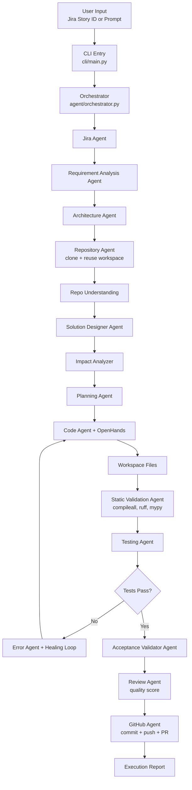

# Autonomous Dev Agent Report

## 1. Project Purpose

The Autonomous Dev Agent is a Python-based software engineering automation system that takes either a Jira story or a natural-language prompt and drives the full delivery loop: understand requirements, inspect the repository, generate code, run tests, fix failures, commit changes, and open a GitHub pull request.

This project exists to reduce the manual handoff between product requirements and engineering execution. Instead of using separate tools for requirement reading, repo analysis, code generation, testing, and GitHub operations, this repository combines them into one orchestrated workflow.

## 2. High-Level Architecture

The system is built around one central controller and several specialized agents, organized into typed phase layers:

**Core control**
- Orchestrator: controls the 15-step workflow from start to finish.
- Error Agent: classifies failures and prevents infinite healing loops.
- GitHub Agent: commits, pushes, and opens a pull request.

**Understanding layer**
- Jira Agent: converts Jira or free-text prompts into structured requirements JSON.
- Requirement Analysis Agent: transforms raw requirements into typed `RequirementAnalysisContract` objects.
- Architecture Agent: derives architecture style, modules, and integration points from requirements and repo context.

**Planning layer**
- Solution Designer Agent: designs concrete file targets and implementation steps before any code is written.
- Impact Analyzer: identifies which files to modify, create, or avoid and which tests are affected.
- Planning Agent: converts design and impact outputs into a deterministic ordered implementation roadmap.
- Prompt Builder: turns requirements and repo context into high-quality implementation prompts.

**Execution layer**
- Code Agent: orchestrator-facing code-generation API backed by OpenHands.
- OpenHands / openhands_runtime: performs implementation work inside the workspace sandbox.

**Validation layer**
- Static Validation Agent: runs `compileall`, `ruff`, and `mypy` before tests run.
- Testing Agent: runs project-appropriate install, lint, build, and test commands.
- Acceptance Validator Agent: checks test outcomes and static results against acceptance criteria.
- Review Agent: computes a quality score and flags oversized files, missing tests, or low coverage.

**MCP integration**
- MCP Server (`local_mcp_server/`): exposes Jira and GitHub capabilities as tool calls.

This split is useful because each part has one clear responsibility. That makes the workflow easier to test, replace, and extend.

### Architecture Layers

- Input layer: the user starts the workflow through the CLI or Python module entry point.
- Control layer: the orchestrator manages state, sequencing, retries, and final reporting.
- Understanding layer: Jira Agent, Requirement Analysis Agent, Architecture Agent, and Repo Agent convert the problem and codebase into typed structured context.
- Planning layer: Solution Designer, Impact Analyzer, Planning Agent, and Prompt Builder convert context into a concrete implementation strategy.
- Execution layer: Code Agent and OpenHands perform actual coding work inside the workspace.
- Validation layer: Static Validation, Testing Agent, Error Agent, Acceptance Validator, and Review Agent verify quality and support healing.
- Delivery layer: the GitHub Agent commits the result, pushes the branch, and opens the pull request.

### Architecture Flow



#### Architecture Flow Without Mermaid

```text
User Input (Jira Story ID or Prompt)
   |
   v
CLI Entry (cli/main.py)
   |
   v
Orchestrator — 15-step pipeline (agent/orchestrator.py)
   |
   Step 1:  Jira Agent     → structured requirements JSON
   Step 2:  Requirement Analysis Agent → RequirementAnalysisContract
   Step 3:  Architecture Agent         → ArchitectureContract
   Step 4:  Project Context Loading    → memory of previous runs
   Step 5:  Repository Agent           → clone (or reuse) + branch
   Step 6:  Repository Understanding   → framework, routes, models, tests
   Step 7:  Solution Designer Agent    → SolutionDesignContract
   Step 8:  Impact Analyzer            → ImpactAnalysisContract (modify/create/avoid)
   Step 9:  Planning Agent             → ImplementationPlanContract (ordered steps)
   Step 10: Code Agent + OpenHands     → files written to workspace
   Step 11: Static Validation Agent    → compileall + ruff + mypy gate
   Step 12: Testing Agent + Healing    → pytest/jest/go test; auto-fix on failure
   Step 13: Acceptance Validator Agent → criteria satisfied check
   Step 14: Review Agent               → quality score ≥ 85 gate
   Step 15: GitHub Agent               → commit, push, pull request
   |
   v
Execution Report (status, files, tests, PR URL, quality score)
```

The actual execution flow of the system is:

1. The user starts the agent through `agent run`, `python -m app`, or a prompt-based command.
2. `cli/main.py` loads configuration, validates credentials, and creates the orchestrator.
3. `agent/orchestrator.py` starts the 15-step workflow and initializes typed state tracking.
4. `agent/jira_agent.py` either fetches a Jira story or converts a natural-language prompt into structured requirements JSON.
5. `agent/requirement_agent.py` converts raw requirements into a typed `RequirementAnalysisContract`.
6. `agent/architecture_agent.py` derives architecture style, relevant modules, and integration points as a typed `ArchitectureContract`.
7. Project context memory is loaded from disk (previous run decisions and stack knowledge).
8. `agent/repo_agent.py` clones the target repository **or reuses the existing workspace** if it already has a `.git` directory. If cleanup of a locked folder fails (Windows WinError 32), a unique timestamped fallback folder is used instead.
9. Repository understanding extracts entry points, models, routes, services, tests, and middleware paths.
10. `agent/solution_designer.py` produces a `SolutionDesignContract` listing files to modify, files to create, and implementation steps.
11. `agent/impact_analyzer.py` identifies files to modify, create, and avoid, and which tests are affected, as an `ImpactAnalysisContract`.
12. `agent/planning_agent.py` converts design and impact analysis into an ordered `ImplementationPlanContract`.
13. `agent/code_agent.py`, `agent/openhands_agent.py`, and `agent/openhands_runtime.py` execute implementation work in the workspace, guided by the full plan context.
14. `agent/static_validation.py` runs `compileall`, `ruff`, and `mypy` as a quality gate before tests.
15. `agent/testing_agent.py` runs install, lint, build, and test commands depending on the detected project type. On failure, `agent/error_agent.py` classifies the failure, prevents repeat loops, and triggers a targeted fix.
16. `agent/acceptance_validator.py` verifies the implementation satisfies each acceptance criterion.
17. `agent/review_agent.py` scores quality (0–100) and triggers one targeted improvement pass if the score is below 85.
18. After successful validation, `agent/github_agent.py` stages changes, commits, pushes, and creates a pull request.
19. The orchestrator returns a final execution report with status, changed files, test results, quality score, and PR URL.

This flow is important because it shows that the project is not a single AI call. It is a controlled sequence of planning, execution, verification, and delivery.

### Architecture Explanation

- The CLI or module entry point receives the user's request.
- The orchestrator controls the full lifecycle and maintains workflow state.
- The Jira Agent turns input into structured requirements.
- The Repo Agent prepares the target repository and extracts coding context.
- The Prompt Builder improves the quality of the implementation and design prompts.
- The OpenHands and Code Agent layer performs actual coding work inside the workspace.
- The Testing Agent verifies the output against the target project's stack.
- The Error Agent supports retry and healing logic when tests fail.
- The GitHub Agent converts successful work into a commit, push, and PR.

This architecture is used because autonomous coding works best when planning, execution, validation, and delivery are separated but coordinated by one controller.

## 3. End-to-End Workflow

The implemented pipeline is a 15-step sequence:

1. Accept a Jira story ID or natural-language prompt.
2. Convert the request into a typed `RequirementAnalysisContract`.
3. Derive an `ArchitectureContract` (style, modules, integration points).
4. Load project context memory from previous runs.
5. Clone the target repository and create a feature branch — or reuse the existing workspace folder if the repo is already cloned.
6. Analyze the codebase to detect language, framework, test setup, entry points, models, routes, and middleware.
7. Produce a `SolutionDesignContract` before writing any code.
8. Analyze codebase impact: determine which files to modify, create, or avoid, and which tests are affected.
9. Produce an ordered `ImplementationPlanContract` from design and impact data.
10. Generate or modify code in the workspace using OpenHands guided by the full plan context.
11. Run static validation (compileall, ruff, mypy) as a pre-test quality gate.
12. Run tests and quality checks with autonomous healing on failure.
13. Validate the result against acceptance criteria.
14. Score quality (0–100) with the Review Agent and improve if below 85.
15. Commit, push, and create a GitHub pull request.

This sequence is the main value of the project: it is not only a code generator, but a design-first, validation-backed delivery pipeline.

### Workflow Of Autonomous Dev Agent

The complete working flow of the project is:

1. User gives input: A Jira story ID or natural-language prompt is passed to the system through the CLI.
2. CLI starts execution: `cli/main.py` loads configuration, validates environment variables, and starts the orchestrator.
3. Orchestrator creates workflow state: `agent/orchestrator.py` tracks the current step and all typed phase contracts.
4. Requirements are parsed: `agent/jira_agent.py` fetches Jira details or converts the prompt into structured requirements JSON.
5. Requirements are analyzed: `agent/requirement_agent.py` produces a typed `RequirementAnalysisContract`.
6. Architecture is derived: `agent/architecture_agent.py` produces a typed `ArchitectureContract` (style, modules, risks).
7. Project context is loaded: previous run tech-stack and decision memory is loaded from disk.
8. Repository is prepared: `agent/repo_agent.py` reuses the existing workspace if already cloned, otherwise clones and creates a branch.
9. Repository is understood: entry points, models, routes, services, tests, and middleware paths are indexed.
10. Solution is designed: `agent/solution_designer.py` produces `SolutionDesignContract` before any code is written.
11. Impact is analyzed: `agent/impact_analyzer.py` identifies exact files to modify, create, or avoid.
12. Plan is built: `agent/planning_agent.py` produces an ordered `ImplementationPlanContract`.
13. Code is generated: `agent/code_agent.py` and `agent/openhands_agent.py` implement the plan in the workspace.
14. Static validation runs: `agent/static_validation.py` runs compileall, ruff, and mypy before tests.
15. Tests are executed: `agent/testing_agent.py` runs install, build, lint, and test commands. `agent/error_agent.py` supports healing on failure.
16. Acceptance is validated: `agent/acceptance_validator.py` checks each acceptance criterion.
17. Quality is scored: `agent/review_agent.py` scores 0–100 and may trigger a targeted improvement pass.
18. GitHub delivery happens: `agent/github_agent.py` stages, commits, pushes, and creates the pull request.
19. Final output is produced: execution report with status, files changed, test results, quality score, and PR URL.

### Why This Workflow Is Important

- It converts raw requirements into structured engineering work.
- It ensures repository context is understood before code generation starts.
- It includes validation and repair, not just code writing.
- It connects implementation directly to Git and GitHub delivery.
- It makes the whole system suitable for autonomous development demonstrations.

### Project Structure

```text
autonomous-dev-agent/
├── agent/
│   ├── orchestrator.py          # Master 15-step workflow controller
│   ├── jira_agent.py            # Jira integration + requirement parsing
│   ├── requirement_agent.py     # Typed requirement analysis (RequirementAnalysisContract)
│   ├── architecture_agent.py    # Architecture derivation (ArchitectureContract)
│   ├── solution_designer.py     # Solution design before coding (SolutionDesignContract)
│   ├── impact_analyzer.py       # Codebase impact analysis (ImpactAnalysisContract)
│   ├── planning_agent.py        # Ordered implementation plan (ImplementationPlanContract)
│   ├── phase_contracts.py       # Shared typed dataclass contracts for all phases
│   ├── repo_agent.py            # Repository clone/reuse + analysis
│   ├── code_agent.py            # Code generation interface (delegates to OpenHands)
│   ├── openhands_agent.py       # OpenHands workflow integration
│   ├── openhands_runtime.py     # OpenHands runtime wrapper
│   ├── static_validation.py     # compileall + ruff + mypy gate (StaticValidationContract)
│   ├── testing_agent.py         # Multi-language test runner
│   ├── acceptance_validator.py  # Acceptance criteria compliance (AcceptanceValidationContract)
│   ├── review_agent.py          # Quality scoring (ReviewReportContract)
│   ├── github_agent.py          # Git operations + PR creation
│   ├── error_agent.py           # Error analysis and retry loop protection
│   ├── prompt_builder.py        # Prompt engineering for implementation
│   ├── task_classifier.py       # Task type detection
│   ├── intent_classifier.py     # Intent classification
│   ├── learning_system.py       # Cross-run learning persistence
│   └── config.py                # Configuration dataclasses and validation
├── app/
│   ├── __main__.py              # Supports python -m app
│   ├── main.py                  # App entry point
│   ├── models.py                # App data models
│   ├── routes.py                # App routes
│   └── services/
│       └── project_context_manager.py  # Project memory across runs
├── local_mcp_server/
│   ├── __init__.py              # Package export
│   └── server.py                # MCP server (Jira + GitHub tools)
├── agent_mcp/
│   ├── __init__.py
│   └── server.py                # Agent MCP server variant
├── cli/
│   ├── __init__.py              # CLI package export
│   └── main.py                  # Rich CLI interface (15-step progress display)
├── sandbox/
│   ├── Dockerfile               # Multi-runtime container
│   └── docker-compose.yml       # Sandbox orchestration
├── tests/
│   ├── test_agents.py           # Unit tests (26 tests)
│   └── test_phase_agents.py     # Typed phase-agent and contract tests
├── workspace/
│   └── Demo_openHands/          # Single stable workspace folder per project
│       ├── app.py               # Generated Flask application
│       ├── extensions.py        # Shared SQLAlchemy instance
│       ├── models.py            # Generated data models
│       ├── test_app.py          # Generated tests
│       ├── templates/           # Bootstrap UI templates
│       └── instance/            # SQLite database files
├── README.md
├── pyproject.toml
├── agent.sh
├── requirements.txt
└── AUTONOMOUS_DEV_AGENT_REPORT.md
```

### Repository Folder Structure With File Responsibilities

- `agent/orchestrator.py`: main 15-step controller for the complete autonomous workflow.
- `agent/jira_agent.py`: fetches Jira stories or converts prompts into structured requirements.
- `agent/requirement_agent.py`: produces a typed `RequirementAnalysisContract` from raw story data.
- `agent/architecture_agent.py`: derives `ArchitectureContract` (style, modules, integration points, risks).
- `agent/solution_designer.py`: creates `SolutionDesignContract` before any code is written.
- `agent/impact_analyzer.py`: identifies files to modify, create, or avoid and which tests are affected.
- `agent/planning_agent.py`: produces an ordered `ImplementationPlanContract` from design and impact.
- `agent/phase_contracts.py`: shared typed dataclass contracts used across all phase agents.
- `agent/repo_agent.py`: clones or reuses repositories, creates branches, and analyzes the target codebase. Falls back to unique folder when cleanup of a locked workspace fails (Windows WinError 32).
- `agent/code_agent.py`: exposes the code-generation interface used by the orchestrator.
- `agent/openhands_agent.py`: integrates OpenHands into the agent workflow for coding and fixing.
- `agent/openhands_runtime.py`: manages runtime execution and workspace interaction for OpenHands tasks.
- `agent/static_validation.py`: runs compileall, ruff, and mypy as a pre-test quality gate.
- `agent/testing_agent.py`: detects project type and runs lint, build, and test commands.
- `agent/acceptance_validator.py`: checks test and static results against story acceptance criteria.
- `agent/review_agent.py`: scores quality 0-100 and triggers one improvement pass when below 85.
- `agent/github_agent.py`: handles git operations and pull request creation.
- `agent/error_agent.py`: analyzes failures and detects repeated-error loops.
- `agent/prompt_builder.py`: builds high-quality prompts for design and implementation.
- `agent/config.py`: defines structured configuration objects and validation logic.
- `app/main.py`: module-based startup entry point that forwards execution to the CLI.
- `app/__main__.py`: allows `python -m app` execution.
- `app/services/project_context_manager.py`: persists project tech-stack and decision memory across runs.
- `cli/main.py`: command-line interface, 15-step progress display, config loading, and orchestration trigger.
- `cli/__init__.py`: exports the CLI package interface.
- `local_mcp_server/server.py`: exposes Jira and GitHub capabilities through an MCP server.
- `sandbox/Dockerfile`: builds the multi-language runtime container used for isolated execution.
- `sandbox/docker-compose.yml`: defines containerized services for the agent and MCP server.
- `tests/test_agents.py`: 26 unit tests for agent behavior, workflow control, and workspace reuse.
- `tests/test_phase_agents.py`: typed phase-agent and contract tests covering all phase contracts.
- `README.md`: project overview, setup, architecture, and usage documentation.
- `pyproject.toml`: package metadata, dependency definitions, and tool configuration.
- `requirements.txt`: direct Python dependency installation list.
- `agent.sh`: shell runner for local and Docker-based execution.
- `AUTONOMOUS_DEV_AGENT_REPORT.md`: project report document for explanation and demonstration.

### Folder-Level Purpose

- `agent/`: contains the core autonomous development logic and all 15 phase agents.
- `app/`: contains Python module entry points and project context memory service.
- `cli/`: contains the interactive command-line interface.
- `local_mcp_server/`: contains the tool server for MCP-based Jira and GitHub integrations.
- `agent_mcp/`: contains a secondary MCP server variant.
- `sandbox/`: contains Docker runtime and deployment files.
- `tests/`: contains test coverage for the framework itself (26 tests across 2 test files).
- `workspace/`: contains a single stable workspace folder per project; reused across runs.

### Workspace Folder Behavior

Each project gets exactly **one** stable workspace folder under `workspace/` based on the repository name (e.g., `workspace/Demo_openHands/`). On repeated runs the agent reuses the existing folder rather than creating a new timestamped one. If the existing workspace cannot be cleaned due to a locked file (e.g., Windows WinError 32 on a SQLite `.db` file), the agent falls back to a unique `<repo>_<timestamp>` folder rather than aborting the workflow.

## 5. Top-Level Repository Parts

### agent/

This is the core application package. It contains the workflow controller and all specialized agents.

Why it is used:
It keeps the business logic separated from the CLI and packaging layer. That makes the system reusable from both command-line entry points and other Python integrations.

### app/

This package provides Python module entry points such as `python -m app` and `python -m app.main`.

Why it is used:
It gives a stable execution surface for users who prefer module invocation instead of the installed `agent` command.

### cli/

This package implements the command-line interface using Click and Rich.

Why it is used:
It makes the product operable by humans. Without the CLI, the system would only be a library. Click simplifies command parsing and Rich improves terminal output and progress visibility.

### mcp/

This package hosts the Model Context Protocol server.

Why it is used:
It exposes Jira and GitHub actions as tools so agent systems can call them in a structured, tool-based way instead of relying only on raw prompt text.

### sandbox/

This folder contains Docker artifacts for isolated execution.

Why it is used:
Autonomous code generation and test execution are safer and more reproducible in a containerized environment. It also allows multi-language support in one prepared runtime image.

### tests/

This folder contains pytest-based tests for the agent system itself.

Why it is used:
An autonomous workflow needs strong regression protection. These tests verify agent behavior, orchestration, parsing, and key workflow transitions.

### workspace/

This is the working area where the agent operates on cloned repositories or generated projects.

Why it is used:
It isolates generated or modified code from the framework code of the agent itself. That prevents self-mutation of the controller and makes each run easier to inspect.

### README.md

This is the product-level documentation.

Why it is used:
It explains the architecture, modes, quick start, and operating model for users and reviewers.

### pyproject.toml

This is the packaging and tool configuration file.

Why it is used:
It defines installable metadata, dependencies, test settings, and the `agent` console script. It is the standard Python packaging entry point for this repository.

### requirements.txt

This is the explicit dependency list.

Why it is used:
It provides a direct installation path, especially useful for runtime images and simpler environments where editable installs are still paired with dependency pinning.

### agent.sh

This is a shell launcher for local or Docker-based execution.

Why it is used:
It reduces setup friction by auto-creating a virtual environment locally and by providing a switch for Docker-based runs.

## 6. Core Agent Package Breakdown

### agent/orchestrator.py

Role:
This is the master controller. It defines the 15-step workflow, tracks state using typed contracts at each phase, calls sub-agents in sequence, manages retry and healing loops, records errors, and returns a final execution report.

Why it is used:
Without an orchestrator, the system would be a collection of disconnected utilities. This file is the coordination layer that turns multiple phase agents into one autonomous delivery product.

### agent/jira_agent.py

Role:
Fetches Jira issue data or converts a free-text prompt into structured development requirements using the LLM.

Why it is used:
Raw Jira descriptions are noisy and inconsistent. This agent normalizes the input into a predictable JSON structure that the rest of the pipeline can rely on.

### agent/requirement_agent.py

Role:
Converts raw story JSON into a typed `RequirementAnalysisContract`, separating functional requirements, non-functional requirements, acceptance criteria, risks, and dependencies.

Why it is used:
Untyped requirement dicts propagate silently wrong shapes. The contract guarantees that downstream phase agents always receive consistent, validated requirement data.

### agent/architecture_agent.py

Role:
Derives an `ArchitectureContract` from requirements and repository analysis, identifying architecture style, relevant modules, integration points, and inherited risks.

Why it is used:
Solution design needs an architecture frame before deciding which files to touch. This step separates architecture reasoning from implementation planning.

### agent/phase_contracts.py

Role:
Defines all shared typed dataclass contracts used across phase agents:
`RequirementAnalysisContract`, `ArchitectureContract`, `SolutionDesignContract`, `ImpactAnalysisContract`, `ImplementationPlanContract`, `StaticValidationContract`, `AcceptanceValidationContract`, `ReviewReportContract`.

Why it is used:
Typed contracts prevent the orchestrator from passing unvalidated dicts between phases. Each phase agent produces and consumes well-defined structured output.

### agent/solution_designer.py

Role:
Produces a `SolutionDesignContract` specifying which files to modify, which files to create, implementation steps, architecture changes, and a test plan — all before code generation starts.

Why it is used:
Code generation guided by an upfront design is significantly more accurate than generation with only a raw prompt. The design contract gives the implementation step a precise scope.

### agent/impact_analyzer.py

Role:
Analyzes the workspace codebase to determine which files to modify, create, or avoid, and which existing tests are affected, based on the feature query. Outputs an `ImpactAnalysisContract`.

Why it is used:
Autonomous code generation can touch unrelated files without a scope boundary. The impact analyzer constrains the implementation to relevant files only.

### agent/planning_agent.py

Role:
Converts `SolutionDesignContract` and `ImpactAnalysisContract` into a deterministic ordered `ImplementationPlanContract` — a flat list of steps: modify existing files, create new files, then run validation and tests.

Why it is used:
A concrete ordered plan is better than asking the LLM to figure out sequencing at generation time. This step keeps implementation reasoning predictable.

### agent/repo_agent.py

Role:
Clones the target repository and creates a feature branch. If the workspace already contains a `.git` directory from a previous run, it reuses that folder and checks out a fresh branch using `git checkout -B`. If cleanup of an existing folder fails due to a locked file (Windows WinError 32), it falls back to a unique timestamped workspace instead of aborting.

Why it is used:
Code generation is only useful when it follows the target repository's existing framework, language, style, and layout. This agent provides that context. The reuse behavior prevents unnecessary re-cloning on every run and avoids accumulating orphaned workspace folders.

### agent/prompt_builder.py

Role:
Builds structured prompts for solution design and implementation.

Why it is used:
Prompt quality directly affects generated code quality. This component separates prompt engineering from orchestration logic so the prompt strategy can evolve independently.

### agent/code_agent.py

Role:
Provides the orchestrator-facing code generation API and delegates actual implementation work to OpenHands. Builds a rich engineering task prompt from story, repository analysis, solution design, implementation plan, and impact analysis.

Why it is used:
It preserves a clean abstraction boundary. The orchestrator calls a code-generation agent interface, while the actual implementation backend can remain OpenHands-based.

### agent/openhands_agent.py

Role:
Defines the OpenHands development agent, task context, task result, and workflow integration layer used during implementation and fixes.

Why it is used:
This is the bridge between the workflow controller and OpenHands' autonomous coding capability. It packages requirements, repo context, and testing expectations into executable development tasks.

### agent/openhands_runtime.py

Role:
Wraps OpenHands runtime behavior and handles sandbox task execution, output collection, and modified-file detection.

Why it is used:
It isolates low-level runtime concerns from business logic. That keeps the orchestration layer simpler and makes future runtime changes easier.

### agent/static_validation.py

Role:
Runs `python -m compileall`, `ruff check`, and `mypy` against the workspace before tests execute. Returns a `StaticValidationContract` with a passed flag, issue list, and raw output.

Why it is used:
Catching syntax errors, import errors, and type errors before running tests reduces wasted test cycles and gives earlier, more precise failure signals.

### agent/testing_agent.py

Role:
Detects project type and runs the appropriate install, lint, build, and test commands for Python, Node.js, Go, Java, and Rust.

Why it is used:
The agent is intended to work across multiple ecosystems, so testing cannot be hardcoded to only one language stack.

### agent/acceptance_validator.py

Role:
Verifies that each acceptance criterion from the story is satisfied based on test results, static validation outcome, and generated files. Returns an `AcceptanceValidationContract`.

Why it is used:
Test passing alone does not confirm that all business requirements are met. Acceptance validation explicitly checks each criterion and surfaces missing ones.

### agent/review_agent.py

Role:
Scores the implementation 0–100 based on test passing, static validation, presence of generated files, and file size. Returns a `ReviewReportContract`. If score is below 85, the orchestrator triggers one targeted improvement pass.

Why it is used:
An autonomous workflow that only checks "tests pass" may still produce poor-quality code. The review gate adds a senior-reviewer perspective.

### agent/error_agent.py

Role:
Classifies failures, extracts likely root causes, identifies affected files, suggests healing strategies, and detects repeated failure loops.

Why it is used:
Autonomous repair is risky if the system keeps retrying the same broken fix. This agent adds control and prevents wasteful infinite loops.

### agent/github_agent.py

Role:
Stages changes, commits, pushes a branch, creates a GitHub pull request, and optionally applies labels.

Why it is used:
The goal of the product is not just code generation but delivery into a real engineering workflow. GitHub integration is what closes that loop.

### agent/config.py

Role:
Defines typed dataclass-based configuration for Jira, GitHub, OpenHands, and general runtime settings.

Why it is used:
Configuration needs to be validated and structured. Dataclasses reduce configuration sprawl and make settings easier to reason about.

## 7. CLI and Application Layer

### cli/main.py

Role:
Defines the `agent` CLI, loads environment variables, validates required configuration, shows progress, and invokes the orchestrator.

Why it is used:
This is the main user interface. It turns the framework into a usable developer tool and improves operability with structured output.

### cli/__init__.py

Role:
Exports the CLI object.

Why it is used:
It keeps package imports clean and supports the console-script integration defined in packaging.

### app/main.py and app/__main__.py

Role:
Provide module-based startup by delegating directly to the CLI.

Why it is used:
These files improve usability and compatibility with Python's `-m` execution model.

## 8. MCP Server Layer

### local_mcp_server/server.py

Role:
Defines an MCP server exposing Jira and GitHub operations such as fetching stories, updating status, adding comments, reading repo files, and creating pull requests. The package was moved from `mcp/` to `local_mcp_server/` to avoid shadowing the installed `mcp` library package.

Why it is used:
MCP is useful when the system needs tool-based interoperability with agent platforms. It gives structured APIs to external AI clients without forcing them to call raw REST endpoints directly.

## 9. Sandbox and Deployment Layer

### sandbox/Dockerfile

Role:
Builds a runtime image with Python, Node.js, Java, Go, Rust, test tooling, and the agent package installed.

Why it is used:
The agent targets polyglot repositories. A single prepared image with multiple toolchains allows the same automation workflow to operate across different project types.

### sandbox/docker-compose.yml

Role:
Defines the main agent service and MCP server service with mounted workspace volumes and environment settings.

Why it is used:
It standardizes deployment, makes local setup faster, and supports isolated repeatable execution.

## 10. Testing Strategy

### tests/test_agents.py (19 tests)

Role:
Tests Jira parsing helpers, code-generation delegation, repository workspace reuse, Windows lock-file fallback, project-type detection, output parsing, and orchestrator workflow behavior.

Key regression tests added:
- `test_clone_reuses_existing_workspace`: verifies that a repo with an existing `.git` directory is reused without re-cloning.
- `test_clone_uses_unique_workspace_when_cleanup_fails`: verifies that a WinError 32 locked-file condition falls back to a unique workspace instead of aborting.

Why it is used:
This file verifies that the autonomous control flow behaves correctly even when external systems are mocked. That is important because the project depends on LLMs, GitHub, Jira, and OpenHands, which are expensive or unstable to hit during unit tests.

### tests/test_phase_agents.py (7 tests)

Role:
Tests all typed phase-agent contracts end to end:
- `RequirementAnalysisAgent` → `RequirementAnalysisContract`
- `SolutionDesignerAgent` → `SolutionDesignContract`
- `PlanningAgent` → `ImplementationPlanContract`
- `StaticValidationAgent` → `StaticValidationContract`
- `AcceptanceValidatorAgent` → `AcceptanceValidationContract`
- `ReviewAgent` → `ReviewReportContract`

Why it is used:
Phase contracts must produce correct typed outputs regardless of LLM responses. These tests verify deterministic contract behavior with mocked subprocess and no external API calls.

**Total test count: 26 tests, all passing.**

## 11. Demonstration Workspace Output

The `workspace/OpenHands/` folder is a good example of what this system can produce during a run.

### workspace/OpenHands/app.py

Role:
Generated Flask application with routes for listing posts, viewing a post, creating admin posts, toggling publish state, and serving stats JSON.

Why it is used:
It demonstrates that the autonomous workflow can generate a full CRUD-style application from a natural-language prompt.

### workspace/OpenHands/models.py

Role:
Defines `Post` and `Comment` models with SQLAlchemy.

Why it is used:
It shows the data-modeling output of the agent and reflects how requirements become persistent structures.

### workspace/OpenHands/extensions.py

Role:
Holds the shared SQLAlchemy `db` instance.

Why it is used:
This pattern avoids circular imports and demonstrates the framework rules enforced in the agent prompts.

### workspace/OpenHands/seed_data.py

Role:
Seeds the database with sample posts and comments.

Why it is used:
Seed data makes demos immediate and testable. It proves the agent can create not only code but also usable example data.

### workspace/OpenHands/templates/

Role:
Contains the Bootstrap-based HTML templates for the blog UI.

Why it is used:
A demonstration is stronger when it includes a visible user interface, not only backend endpoints.

### workspace/OpenHands/test_app.py

Role:
Contains tests for post creation, publish toggling, comment submission, and stats API behavior.

Why it is used:
It proves the generated application is test-backed, not just scaffolded.

## 12. Key Dependencies and Why They Were Chosen

- `openai`: used for requirement extraction, solution design, and validation.
- `openhands-ai`: used for autonomous code generation and sandbox-style development execution.
- `mcp`: used to expose Jira and GitHub operations as tool calls.
- `httpx` and `aiohttp`: used for async HTTP communication with external services.
- `PyGithub` and direct GitHub API calls: used for repository and PR automation.
- `gitpython` plus subprocess git usage: used for local git operations and repository state management.
- `click`: used to build a clean CLI.
- `rich`: used to provide readable CLI output and progress reporting.
- `pydantic`: useful for typed data handling and future validation-heavy expansion.
- `python-dotenv`: used to load configuration from `.env`.
- `tenacity`: included to support retry-friendly workflows around unstable external systems.
- `pytest`, `pytest-asyncio`, `pytest-mock`: used for unit and async workflow testing.
- `docker`: used to support isolated runtime execution.

These libraries were chosen because the project sits at the intersection of orchestration, AI execution, external APIs, and software delivery.

## 13. Why This Design Works

This design is effective because it separates concern areas clearly:

- Requirement understanding is handled separately from code generation.
- Repo understanding is done before implementation, which reduces blind edits.
- Testing and error analysis are explicit workflow stages, not afterthoughts.
- Delivery to GitHub is part of the system, so value is measured in shippable output.
- Docker and OpenHands provide safer execution boundaries for autonomous actions.

In short, the project is not just an LLM wrapper. It is an autonomous software delivery pipeline with dedicated layers for planning, execution, validation, and release.

## 14. Demonstration Summary

To demonstrate this project, the strongest narrative is:

1. Start from a Jira story or prompt.
2. Show how the orchestrator breaks the work into stages.
3. Explain the role of each specialized agent.
4. Show the generated workspace project as proof of execution.
5. Show tests passing.
6. Show that the same system can then commit and open a PR.

That sequence makes it clear why every part of the repository exists.

## 15. Recent Changes Summary

| Area | Change |
|------|--------|
| Pipeline | Expanded from 9 steps to 15 steps with typed phase contracts |
| New agents | `RequirementAnalysisAgent`, `ArchitectureAgent`, `SolutionDesignerAgent`, `ImpactAnalyzer`, `PlanningAgent`, `StaticValidationAgent`, `AcceptanceValidatorAgent`, `ReviewAgent` |
| Contracts | `phase_contracts.py` — 8 typed dataclass contracts used across all phases |
| Workspace | Single stable folder per project; reused on repeated runs via `_reuse_existing_workspace()` |
| Lock fallback | WinError 32 on locked `.db` files now falls back to a unique workspace instead of aborting |
| MCP package | Renamed from `mcp/` to `local_mcp_server/` to avoid shadowing installed `mcp` library |
| Test count | 19 in `test_agents.py` + 7 in `test_phase_agents.py` = **26 total, all passing** |
| Code generation | `code_agent.py` now injects solution design, implementation plan, and impact analysis into the engineering task prompt |
| Test discovery | Orchestrator testing step uses `pytest .` and explicit file discovery instead of fragile shell glob `test_*.py` |

## 16. Final Conclusion

Autonomous Dev Agent is designed to behave like an AI software engineer operating inside a controlled workflow. Each folder and file in the repository supports one part of that goal: input understanding, repository analysis, design, implementation, testing, error recovery, environment isolation, or delivery automation.

The 15-step pipeline with typed contracts is what makes this system robust. Each phase agent produces a well-defined typed output consumed by the next phase, which eliminates the silent shape mismatches that break autonomous workflows. The workspace reuse behavior, lock-file fallback, static validation gate, and quality review score are the control points that turn AI code generation from experimental into reliable.
